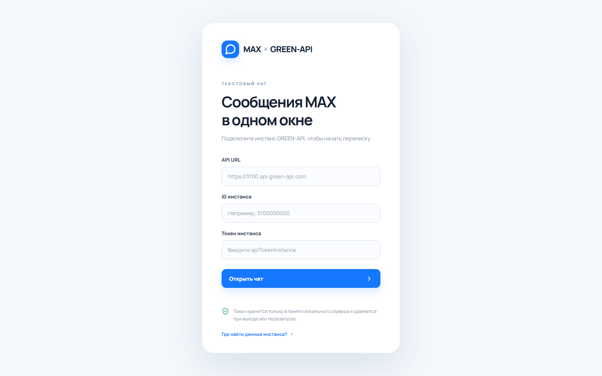
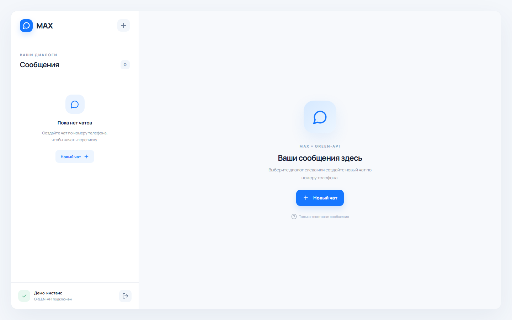
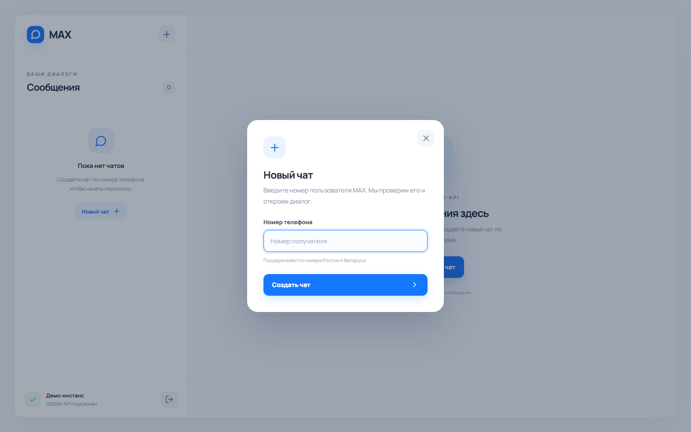
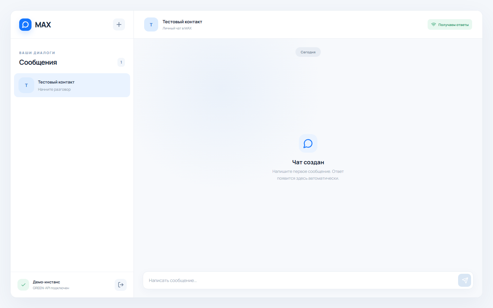
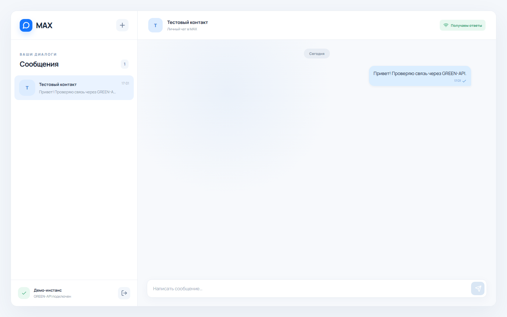
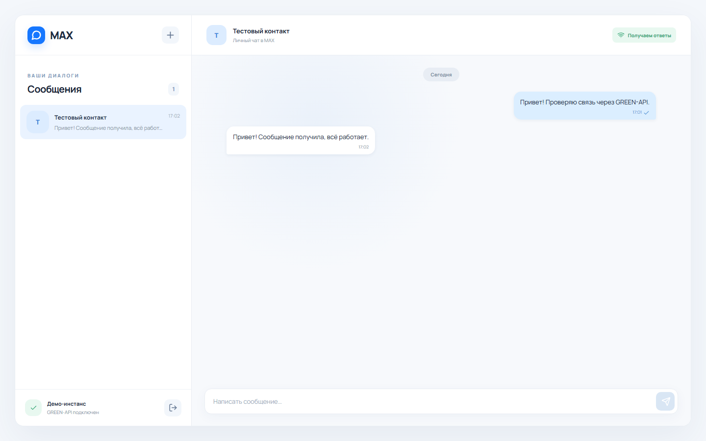

Чат MAX через GREEN-API

Это тестовое задание на позицию React-разработчика. В приложении можно создать чат по номеру телефона, отправить текстовое сообщение в MAX и увидеть ответ. Интерфейс написан на React и TypeScript.

Как запустить

Понадобится Node.js версии 20 или новее. В папке проекта установите зависимости командой npm ci. Затем откройте два терминала. В первом выполните npm run server, во втором npm run dev. Приложение будет доступно по адресу http://127.0.0.1:5173.

Чтобы запустить тесты и проверить сборку, выполните npm run check.

Как проверить переписку

Сначала создайте и авторизуйте инстанс MAX в кабинете GREEN-API: https://console.green-api.com/. В приложении понадобятся три значения из кабинета: apiUrl, idInstance и apiTokenInstance.

В настройках инстанса оставьте webhookUrl пустым и включите уведомления о входящих сообщениях. После этого подключитесь в приложении, создайте чат по номеру получателя и отправьте ему текст. Когда получатель ответит в MAX, ответ появится в чате.

Для отправки используется SendMessage. Номер получателя сначала проверяется через CheckAccount, чтобы получить идентификатор чата. Ответы читаются через ReceiveNotification и подтверждаются через DeleteNotification.

Небольшой локальный сервер хранит токен и обрабатывает входящие уведомления. После его перезапуска история чатов в приложении исчезает. Для проверки лучше использовать отдельный инстанс, поскольку приложение обрабатывает его общую очередь уведомлений.

Автоматические тесты и сборка проходят. Ниже показан интерфейс с вымышленными данными.

Подключение

После подключения

Создание чата

Новый чат

Отправленное сообщение

Ответ получателя

